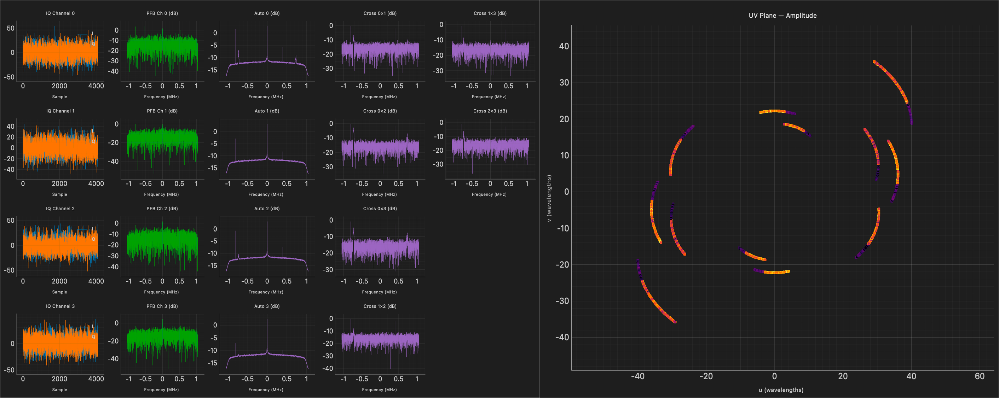
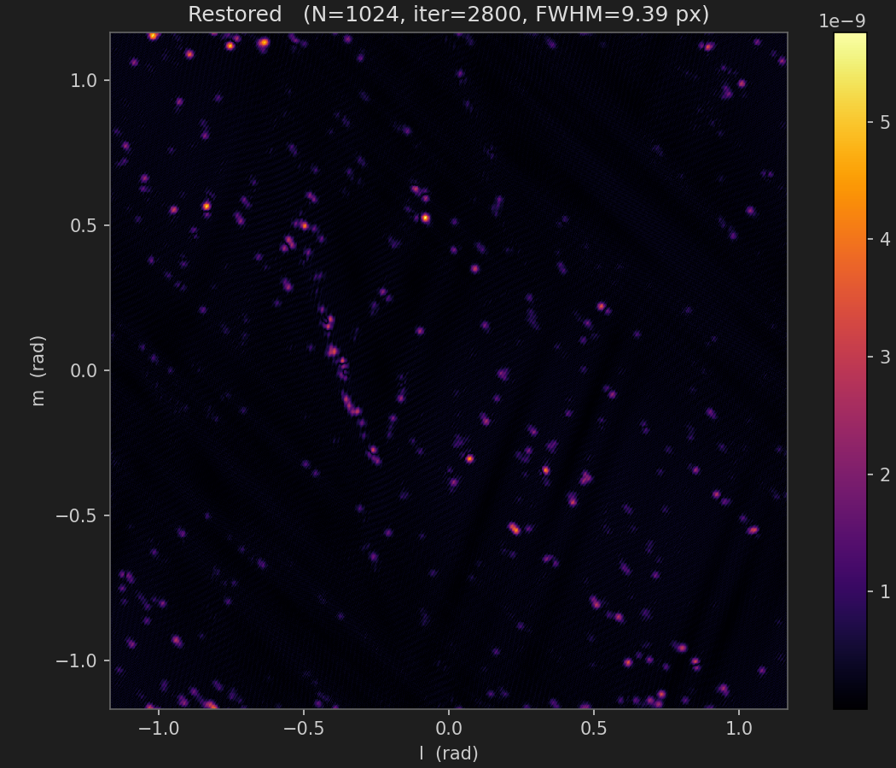
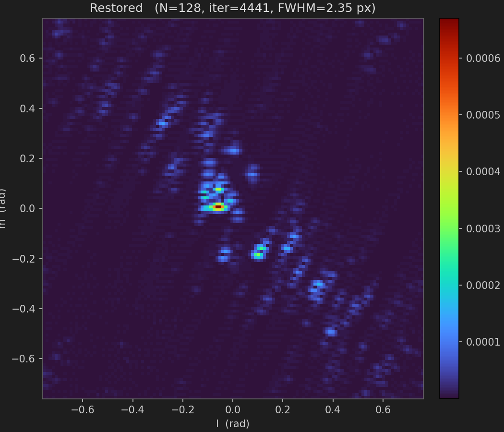

# Open-Radio-Interferometry

[](LICENSE)


A software FX correlator and aperture-synthesis imager for amateur radio
astronomy, built around the **Analog Devices FMCOMMS5** (dual-AD9361, four
coherent RX channels) paired with a host PC. All signal processing — channel
acquisition, polyphase channelization, cross-correlation, UV synthesis, dirty
imaging, and CLEAN deconvolution — runs in Python on the host. The FPGA simply
streams raw IQ to the host over the standard ADI IIO interface.

The default configuration targets the **1420.405 MHz neutral-hydrogen line**
with a 4-element interferometer.



## Results

Hogbom CLEAN restored images produced by [`ori-clean`](src/open_radio_interferometry/apps/clean_app.py)
on a recorded HI-line capture:

|   |   |
|---|---|
|  |  |

## Features

- Live capture of 4 coherent IQ streams from the FMCOMMS5 over `libiio`
- Multi-process pipeline (capture → PFB → correlator → UI) for low-latency
  real-time operation
- Polyphase filter bank channelizer with selectable prototype window
  (Blackman-Harris, Hamming, Hann, Kaiser) and configurable FFT size / taps
- Full baseline cross-correlator (4 autos + 6 crosses) with configurable
  integration time and DC notch
- UV-plane synthesis from local antenna ENU coordinates, source RA/Dec, and
  observatory lat/lon, with proper LST/hour-angle projection and fringe
  stopping
- Dirty-image gridding + 2-D IFFT, configurable image grid (64²–2048²)
- Interactive Hogbom CLEAN deconvolution dialog (step 1 / 10 / 100 / 1000
  iterations, restored beam fit)
- FITS export of UV visibilities and dirty images (astropy)
- Standalone tools — work without any hardware:
  - `ori-uv`    — open and inspect a UV-plane FITS file
  - `ori-clean` — run interactive CLEAN on any compatible FITS
  - `ori-sim`   — simulate UV coverage for a given array, source, and window
- Persistent settings (QSettings) so the last-used SDR / PFB / correlator
  parameters are restored on launch
- Dark-themed PyQt5 + pyqtgraph UI with dockable plot panels

## Install

```bash
git clone https://github.com/basmundhopk/Open-Radio-Interferometry.git
cd Open-Radio-Interferometry
python3 -m venv .venv
source .venv/bin/activate
pip install -e .              # core: numpy, PyQt5, pyqtgraph, astropy
pip install -e ".[sdr]"       # add pyadi-iio for live FMCOMMS5 capture
```

Requires Python 3.9+. `pyadi-iio` additionally needs the `libiio` runtime
from your OS package manager.

## Run

### Live capture (requires FMCOMMS5)

```bash
ori-live
```

The default IIO URI is `ip:analog.local`. Change it by editing `SDR_URI` at
the top of [src/open_radio_interferometry/apps/main.py](src/open_radio_interferometry/apps/main.py).

The UI opens with live time-domain, spectrum, baseline, UV-plane, and
dirty-image panels. Use the dockable settings panel to change LO frequency,
sample rate, RF bandwidth, gain, PFB parameters, and integration count, then
click **Apply** for each section.

### Try it without hardware

```bash
ori-sim                          # UV-coverage simulator
ori-uv    examples/test.fits     # open a UV-plane FITS
ori-clean examples/test.fits     # interactive Hogbom CLEAN
```

(Drop additional sample FITS captures into [examples/](examples/) so others
can do the same — the folder is whitelisted in `.gitignore`.)

## Repository layout

```
src/open_radio_interferometry/
  settings.py          Default parameters + persistent QSettings schema
  sdr/fmcomms5_iio.py  FMCOMMS5 IIO capture worker
  dsp/pfb.py           Polyphase filter bank prototype + worker
  dsp/correlator.py    Cross-correlation, UV synthesis, fringe stopping, FITS export
  imaging/clean.py     Hogbom CLEAN core (gridding, dirty image, PSF fit, restore)
  ui/main_window.py    PyQt5 main window, control panels, live plots
  ui/clean_dialog.py   Interactive CLEAN dialog
  apps/main.py         Live capture entry point (ori-live)
  apps/uv_app.py       Standalone UV viewer (ori-uv)
  apps/clean_app.py    Standalone CLEAN viewer (ori-clean)
  apps/uv_simulator.py UV-coverage simulator (ori-sim)

docs/                  Architecture and hardware-setup docs
examples/              Sample FITS files for the standalone viewers
tests/                 pytest suite
.github/workflows/     CI (ruff + pytest)
```

See [docs/architecture.md](docs/architecture.md) for the multi-process
pipeline diagram, and [docs/hardware-setup.md](docs/hardware-setup.md) for
FMCOMMS5 wiring and antenna-geometry notes.

## Hardware

- **Analog Devices FMCOMMS5** (EVAL-AD-FMCOMMS5-EBZ) — dual AD9361, 4 coherent
  RX channels, tunable 70 MHz – 6 GHz
- Any host carrier supported by ADI's stock FMCOMMS5 image (e.g. ZC706,
  ZCU102) running the standard ADI Linux + IIO daemon
- 4 antennas with known local East-North-Up positions — defaults are an
  edge-on 25 m square; edit `ANTENNA_POSITIONS_ENU` in
  [src/open_radio_interferometry/settings.py](src/open_radio_interferometry/settings.py)

## Default configuration

| Parameter             | Default                                  |
|-----------------------|------------------------------------------|
| Center frequency      | 1 420.400 MHz (HI line)                  |
| Sample rate           | 2.5 MSPS                                 |
| RF bandwidth          | 2 MHz                                    |
| Gain control          | Fast attack                              |
| Frame size / FFT (P)  | 4096                                     |
| PFB taps per branch (M) | 4                                      |
| Window                | Blackman-Harris                          |
| Integration count     | 10 000 spectra                           |
| Dirty-image grid      | 128 × 128                                |
| RX channels           | 0, 1, 2, 3                               |
| Observatory           | 39.527° N, −119.822° E                   |
| Source declination    | 40.734°                                  |

All values are persisted via `QSettings` between runs.

## Contributing

See [CONTRIBUTING.md](CONTRIBUTING.md).

## License

Licensed under the **Apache License 2.0**. See [LICENSE](LICENSE) for details.
